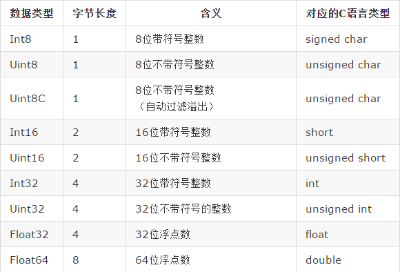

# 二进制数组

- 1、ArrayBuffer对象
- 2、TypedArray视图
- 3、复合视图
- 4、DataView视图
- 5、二进制数组的应用

二进制数组（ArrayBuffer对象、TypedArray视图和DataView视图）是JavaScript操作二进制数据的一个接口。这些对象早就存在，属于独立的规格（2011年2月发布），ES6将它们纳入了ECMAScript规格，并且增加了新的方法。

这个接口的原始设计目的，与WebGL项目有关。所谓WebGL，就是指浏览器与显卡之间的通信接口，为了满足JavaScript与显卡之间大量的、实时的数据交换，它们之间的数据通信必须是二进制的，而不能是传统的文本格式。文本格式传递一个32位整数，两端的JavaScript脚本与显卡都要进行格式转化，将非常耗时。这时要是存在一种机制，可以像C语言那样，直接操作字节，将4个字节的32位整数，以二进制形式原封不动地送入显卡，脚本的性能就会大幅提升。

二进制数组就是在这种背景下诞生的。它很像C语言的数组，允许开发者以数组下标的形式，直接操作内存，大大增强了JavaScript处理二进制数据的能力，使得开发者有可能通过JavaScript与操作系统的原生接口进行二进制通信。

二进制数组由三类对象组成。

**（1）** `ArrayBuffer`对象：代表内存之中的一段二进制数据，可以通过“视图”进行操作。“视图”部署了数组接口，这意味着，可以用数组的方法操作内存。

**（2）** `TypedArray`视图：共包括9种类型的视图，比如`Uint8Array`（无符号8位整数）数组视图, `Int16Array`（16位整数）数组视图, `Float32Array`（32位浮点数）数组视图等等。

**（3）** `DataView`视图：可以自定义复合格式的视图，比如第一个字节是`Uint8`（无符号8位整数）、第二、三个字节是`Int16`（16位整数）、第四个字节开始是`Float32`（32位浮点数）等等，此外还可以自定义字节序。

简单说，`ArrayBuffer`对象代表原始的二进制数据，`TypedArray`视图用来读写简单类型的二进制数据，`DataView`视图用来读写复杂类型的二进制数据。

`TypedArray`视图支持的数据类型一共有9种（`DataView`视图支持除`Uint8C`以外的其他8种）。

注意，二进制数组并不是真正的数组，而是类似数组的对象。

很多浏览器操作的API，用到了二进制数组操作二进制数据，下面是其中的几个。

- File API
- XMLHttpRequest
- Fetch API
- Canvas
- WebSockets

### 1、ArrayBuffer对象

#### 概述

`ArrayBuffer`对象代表储存二进制数据的一段内存，它不能直接读写，只能通过视图（`TypedArray`视图和`DataView`视图)来读写，视图的作用是以指定格式解读二进制数据。

`ArrayBuffer`也是一个构造函数，可以分配一段可以存放数据的连续内存区域。

	var buf = new ArrayBuffer(32);

上面代码生成了一段32字节的内存区域，每个字节的值默认都是0。可以看到，`ArrayBuffer`构造函数的参数是所需要的内存大小（单位字节）。

为了读写这段内容，需要为它指定视图。`DataView`视图的创建，需要提供`ArrayBuffer`对象实例作为参数。
	
	var buf = new ArrayBuffer(32);
	var dataView = new DataView(buf);
	dataView.getUint8(0) // 0

上面代码对一段32字节的内存，建立`DataView`视图，然后以不带符号的8位整数格式，读取第一个元素，结果得到0，因为原始内存的`ArrayBuffer`对象，默认所有位都是0。

另一种`TypedArray`视图，与`DataView`视图的一个区别是，它不是一个构造函数，而是一组构造函数，代表不同的数据格式。

	var buffer = new ArrayBuffer(12);
	
	var x1 = new Int32Array(buffer);
	x1[0] = 1;
	var x2 = new Uint8Array(buffer);
	x2[0]  = 2;
	
	x1[0] // 2

上面代码对同一段内存，分别建立两种视图：32位带符号整数（`Int32Array`构造函数）和8位不带符号整数（`Uint8Array`构造函数）。由于两个视图对应的是同一段内存，一个视图修改底层内存，会影响到另一个视图。

`TypedArray`视图的构造函数，除了接受`ArrayBuffer`实例作为参数，还可以接受普通数组作为参数，直接分配内存生成底层的`ArrayBuffer`实例，并同时完成对这段内存的赋值。
	
	var typedArray = new Uint8Array([0,1,2]);
	typedArray.length // 3
	
	typedArray[0] = 5;
	typedArray // [5, 1, 2]

上面代码使用`TypedArray`视图的`Uint8Array`构造函数，新建一个不带符号的8位整数视图。可以看到，`Uint8Array`直接使用普通数组作为参数，对底层内存的赋值同时完成。

#### ArrayBuffer.prototype.byteLength

`ArrayBuffer`实例的`byteLength`属性，返回所分配的内存区域的字节长度。

	var buffer = new ArrayBuffer(32);
	buffer.byteLength
	// 32

如果要分配的内存区域很大，有可能分配失败（因为没有那么多的连续空余内存），所以有必要检查是否分配成功。

	if (buffer.byteLength === n) {
	  // 成功
	} else {
	  // 失败
	}

#### ArrayBuffer.prototype.slice()

`ArrayBuffer`实例有一个slice方法，允许将内存区域的一部分，拷贝生成一个新的`ArrayBuffer`对象。
	
	var buffer = new ArrayBuffer(8);
	var newBuffer = buffer.slice(0, 3);

上面代码拷贝`buffer`对象的前3个字节（从0开始，到第3个字节前面结束），生成一个新的ArrayBuffer对象。`slice`方法其实包含两步，第一步是先分配一段新内存，第二步是将原来那个`ArrayBuffer`对象拷贝过去。

`slice`方法接受两个参数，第一个参数表示拷贝开始的字节序号（含该字节），第二个参数表示拷贝截止的字节序号（不含该字节）。如果省略第二个参数，则默认到原`ArrayBuffer`对象的结尾。

除了`slice`方法，`ArrayBuffer`对象不提供任何直接读写内存的方法，只允许在其上方建立视图，然后通过视图读写。

#### ArrayBuffer.isView()

`ArrayBuffer`有一个静态方法`isView`，返回一个布尔值，表示参数是否为`ArrayBuffer`的视图实例。这个方法大致相当于判断参数，是否为`TypedArray`实例或`DataView`实例。
	
	var buffer = new ArrayBuffer(8);
	ArrayBuffer.isView(buffer) // false
	
	var v = new Int32Array(buffer);
	ArrayBuffer.isView(v) // true
	
### 2、TypedArray视图

#### 概述

`ArrayBuffer`对象作为内存区域，可以存放多种类型的数据。同一段内存，不同数据有不同的解读方式，这就叫做“视图”（view）。`ArrayBuffer`有两种视图，一种是`TypedArray`视图，另一种是`DataView`视图。前者的数组成员都是同一个数据类型，后者的数组成员可以是不同的数据类型。

目前，`TypedArray`视图一共包括9种类型，每一种视图都是一种构造函数。

- Int8Array：8位有符号整数，长度1个字节。
- Uint8Array：8位无符号整数，长度1个字节。
- Uint8ClampedArray：8位无符号整数，长度1个字节，溢出处理不同。
- Int16Array：16位有符号整数，长度2个字节。
- Uint16Array：16位无符号整数，长度2个字节。
- Int32Array：32位有符号整数，长度4个字节。
- Uint32Array：32位无符号整数，长度4个字节。
- Float32Array：32位浮点数，长度4个字节。
- Float64Array：64位浮点数，长度8个字节。

这9个构造函数生成的数组，统称为`TypedArray`视图。它们很像普通数组，都有length属性，都能用方括号运算符（[]）获取单个元素，所有数组的方法，在它们上面都能使用。普通数组与`TypedArray`数组的差异主要在以下方面。

- TypedArray数组的所有成员，都是同一种类型。
- TypedArray数组的成员是连续的，不会有空位。
- TypedArray数组成员的默认值为0。比如，`new Array(10)`返回一个普通数组，里面没有任何成员，只是10个空位；`new Uint8Array(10)`返回一个`TypedArray`数组，里面10个成员都是0。
- TypedArray数组只是一层视图，本身不储存数据，它的数据都储存在底层的`ArrayBuffer`对象之中，要获取底层对象必须使用`buffer`属性。

#### 构造函数

`TypedArray`数组提供9种构造函数，用来生成相应类型的数组实例。

构造函数有多种用法。

##### （1）TypedArray(buffer, byteOffset=0, length?)

同一个`ArrayBuffer`对象之上，可以根据不同的数据类型，建立多个视图。

	// 创建一个8字节的ArrayBuffer
	var b = new ArrayBuffer(8);
	
	// 创建一个指向b的Int32视图，开始于字节0，直到缓冲区的末尾
	var v1 = new Int32Array(b);
	
	// 创建一个指向b的Uint8视图，开始于字节2，直到缓冲区的末尾
	var v2 = new Uint8Array(b, 2);
	
	// 创建一个指向b的Int16视图，开始于字节2，长度为2
	var v3 = new Int16Array(b, 2, 2);

上面代码在一段长度为8个字节的内存（b）之上，生成了三个视图：v1、v2和v3。

视图的构造函数可以接受三个参数：

- 第一个参数（必需）：视图对应的底层ArrayBuffer对象。
- 第二个参数（可选）：视图开始的字节序号，默认从0开始。
- 第三个参数（可选）：视图包含的数据个数，默认直到本段内存区域结束。

因此，v1、v2和v3是重叠的：v1[0]是一个32位整数，指向字节0～字节3；v2[0]是一个8位无符号整数，指向字节2；v3[0]是一个16位整数，指向字节2～字节3。只要任何一个视图对内存有所修改，就会在另外两个视图上反应出来。

注意，`byteOffset`必须与所要建立的数据类型一致，否则会报错。

	var buffer = new ArrayBuffer(8);
	var i16 = new Int16Array(buffer, 1);
	// Uncaught RangeError: start offset of Int16Array should be a multiple of 2

上面代码中，新生成一个8个字节的`ArrayBuffer`对象，然后在这个对象的第一个字节，建立带符号的16位整数视图，结果报错。因为，带符号的16位整数需要两个字节，所以`byteOffset`参数必须能够被2整除。

如果想从任意字节开始解读`ArrayBuffer`对象，必须使用`DataView`视图，因为`TypedArray`视图只提供9种固定的解读格式。

##### （2）TypedArray(length)

视图还可以不通过`ArrayBuffer`对象，直接分配内存而生成。
	
	var f64a = new Float64Array(8);
	f64a[0] = 10;
	f64a[1] = 20;
	f64a[2] = f64a[0] + f64a[1];

上面代码生成一个8个成员的`Float64Array`数组（共64字节），然后依次对每个成员赋值。这时，视图构造函数的参数就是成员的个数。可以看到，视图数组的赋值操作与普通数组的操作毫无两样。

##### （3）TypedArray(typedArray)

`TypedArray`数组的构造函数，可以接受另一个`TypedArray`实例作为参数。
	
	var typedArray = new Int8Array(new Uint8Array(4));

上面代码中，`Int8Array`构造函数接受一个`Uint8Array`实例作为参数。

注意，此时生成的新数组，只是复制了参数数组的值，对应的底层内存是不一样的。新数组会开辟一段新的内存储存数据，不会在原数组的内存之上建立视图。
	
	var x = new Int8Array([1, 1]);
	var y = new Int8Array(x);
	x[0] // 1
	y[0] // 1
	
	x[0] = 2;
	y[0] // 1

上面代码中，数组y是以数组x为模板而生成的，当x变动的时候，y并没有变动。

如果想基于同一段内存，构造不同的视图，可以采用下面的写法。
	
	var x = new Int8Array([1, 1]);
	var y = new Int8Array(x.buffer);
	x[0] // 1
	y[0] // 1
	
	x[0] = 2;
	y[0] // 2

##### （4）TypedArray(arrayLikeObject)

构造函数的参数也可以是一个普通数组，然后直接生成`TypedArray`实例。
	
	var typedArray = new Uint8Array([1, 2, 3, 4]);

注意，这时`TypedArray`视图会重新开辟内存，不会在原数组的内存上建立视图。

上面代码从一个普通的数组，生成一个8位无符号整数的TypedArray实例。

`TypedArray`数组也可以转换回普通数组。

	var normalArray = Array.prototype.slice.call(typedArray);

### 3、复合视图

### 4、DataView视图

### 5、二进制数组的应用

